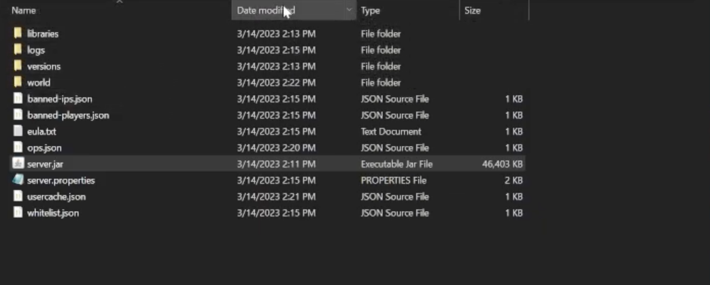
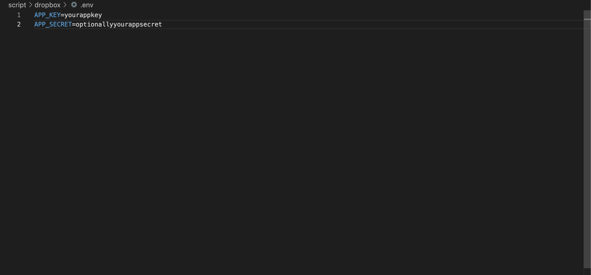

<span>
    <a href="https://github.com/dropbox/dropbox-sdk-python" target="_blank">
        </img>
    </a>
</span>
<span>
    </img>
</span>


# Overview 

When ran, this script will go back one directory and check if there is a directory called ```world-backup```.  
- If there is no such directory, the script will copy the contents of the ```world``` directory and paste them into a new directory called ```world-backup```.  

- If there is such a directory, the script will "override" the ```world-backup``` directory with the content found in the ```world``` directory.  If for some reason your world is gone and you have a backup, all you need to do is rename ```world-backup``` to ```world``` and place it in the root directory of your Minecraft Server

Note: this script *does not* copy every file of your Minecraft server, *only* your world files!

This script can also upload your ```world-backup``` to the following cloud services:

- Dropbox
    - Drobox is fully implemented.  If you want to use Dropbox, scroll down to [#Dropbox](#dropbox) in this README file.

- Google Drive
    - I am currently working on uploading ```world-backup``` to Google Drive.

# Insturctions on How to Use

To use this script, ensure that you have Python 3.10 (or later) installed.  Next locate the folder for your Minecraft Server.  The contents of this folder should look similar to the image below:

<div align="center">
    
</div>

Next, copy the ```'script'``` directory of this project and place it in the root directory of your Minecraft server. Next, copy ```LICENSE.md``` file into that folder.  The ```LICENSE.md``` is simply in the ```script``` directory to comply with the terms found in the [license](LICENSE.md) of this project.  

If you are wanting to copy your world files,

- Open up a terminal, cd to the ```script``` directory, and run ```python main.py```.

If you are wanting to upload your world files,

- Dropbox: see [#Dropbox](#dropbox)
- Google Drive: feature in-progress

# Dropbox

There are two requirements in order to use Dropbox with this script: registering a Dropbox app and installing the proper modules.

## Registering a Dropbox App

- In order to register a Dropbox App, go to [register a Dropbox app](https://www.dropbox.com/developers/apps/create) so you can connect to the Dropbox API (ensure you select "Full Dropbox Access" when registering your app).  

    - After registering your app, go to the [App Console](https://www.dropbox.com/developers/apps), access your app, and click the tab, 'Permissions'.  Ensure you have the following checked:

        - files.metadata.write
        - files.content.write
        - file_requests.write

    - After doing that, go to the 'Settings' tab of your app.  Once there, scroll down until you find "App key".  Copy that key.  If you copied the script directory to the root of your Minecraft server, you should see a subdirectory named ```dropbox```in ```script```.  In the ```dropbox``` folder, create a file named ```.env``` and add the following text: "APP_KEY=[paste the app key you copied here]".

<div align="center">
    
</div>

## Installing Modules

- Ensure you have the following Python Modules installed for Dropbox to work:

    - pip install ```dropbox```
    - pip install ```python-decouple```

## Uploading to Dropbox

There is ***full*** functionality for uploading folders and files to Dropbox.  However, this script ***will not*** upload your /datapacks folder (sorry!).

In you copied the ```script``` directory to the root of your Minecraft server, you will have a subdirectory named ```dropbox``` in ```script```.  Within this directory, you should have three Python script files: ```dbx.py```, ```dbx_auth.py```, and ```dbx_classes.py```.  Additionally, you should have already added your ```.env``` file with the necessary variable(s).  **You do not need to run ```dbx_auth.py``` or ```dbx_classes.py```.**

To upload your world files to Dropbox,

- Open up a terminal, cd to the ```script/dropbox``` directory, and run ```python dbx.py```.  If you have followed the above directions, you will be asked to authenticate with the Dropbox API and will be given instructions (in the console) and be redirected to a link.

- Then, run ```python dbx.py``` again and follow the directions.

# Compatibility

This script works for the following operating system(s):

*Note: I do not have access to a Linux system to test out these scripts.  Do not expect them to work :)

<span>
    
</span>
<span>
    
</span>


# API(s) and Modules Used 

API:

- [Dropbox API](https://www.dropbox.com/developers) ([Python SDK](https://www.dropbox.com/developers/documentation/python)) ([GitHub Source Code](https://github.com/dropbox/dropbox-sdk-python))

Built-in Python Libraries:

- ```shutil```: used to copy and remove specified directories
- ```os```: used to find a specified directory
- ```webbrowser```: used to open URLs in your browser
- ```time```: suspend script execution
- ```re```: string comparisons
- ```json```: read and write to JSON files

Installed Modules:

- [```dropbox```](https://pypi.org/project/dropbox/): connect to and use the Dropbox API
- [```python-decouple```](https://pypi.org/project/python-decouple/): open .env files and read environment varibales


# License

This project uses the MIT license. Please ensure you retain the license notice if you use any part of my program. For more information about the licensing of this project, please see [LICENSE.md](LICENSE.md).